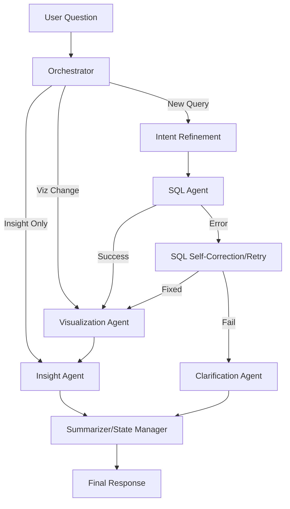

# AskData 💬

AskData is a dataset-agnostic GenAI Data Assistant that allows users to query and analyze data using natural language. Built with a multi-agent architecture using LangGraph and Azure OpenAI, AskData can be easily configured to work with any structured dataset (CSV or Excel) by defining metadata.

## Features

- **Dataset Agnostic**: Switch between different datasets (e.g., Shell Retail, Experimental Campaigns) using a simple environment variable.
- **Multi-Agent Orchestration**: Intelligent routing between specialized agents for query refinement, SQL generation, visualization, and business insights.
- **Automated Semantic Reset**: Autonomously detects when a user is starting a new topic and resets conversation context accordingly.
- **SQL Self-Correction**: Automatically retries and fixes invalid SQL queries using schema diagnostics and error logs.
- **Intelligent Insights**: Generates deep business analysis and recommendations, with the ability to suppress insights when not explicitly requested.
- **Dynamic Visualizations**: Automatically selects and generates the best-fitting Plotly charts (Line, Bar, Pie) based on the data.
- **Conversation Management**: Summarizes history to maintain context and warns users when history length might impact performance.

## Architecture

AskData uses a sophisticated LangGraph workflow to process user questions:



## Setup

1.  **Install the required Python packages:**
    ```bash
    pip install -r requirements.txt
    ```

2.  **Set up your OpenAI API credentials:**
    Create a file named `.streamlit/secrets.toml` and add your Azure OpenAI credentials:
    ```toml
    OPENAI_API_TYPE = "azure"
    OPENAI_API_KEY = "your_openai_api_key"
    OPENAI_API_BASE = "your_openai_api_base"
    OPENAI_API_VERSION = "2024-05-01-preview"
    OPENAI_DEPLOYMENT_NAME = "gpt-4o"
    ```

## How to Run

By default, the application loads the `sample` dataset. You can specify the dataset using the `ACTIVE_DATASET` environment variable:

```bash
# Run with default (sample) dataset
streamlit run app.py

# Run with shell dataset
ACTIVE_DATASET=shell streamlit run app.py
```

## Developer Guide: Adding a New Dataset

To add a new dataset to AskData:

1.  **Prepare Data**: Add your CSV or Excel files to the `Datasets/` directory.
2.  **Update Metadata**: Add a new entry to the `METADATA` dictionary in `metadata.py`. You must define:
    - `domain_context`: The persona/expertise of the assistant for this data.
    - `files`: List of files with their paths, table names, and formats.
    - `column_descriptions`: Descriptions for each column to help the LLM understand the data.
    - `table_info_combined`: A DDL-style string representing the table schemas.
3.  **Switch Dataset**: Set the `ACTIVE_DATASET` environment variable to your new dataset key when running the app.
